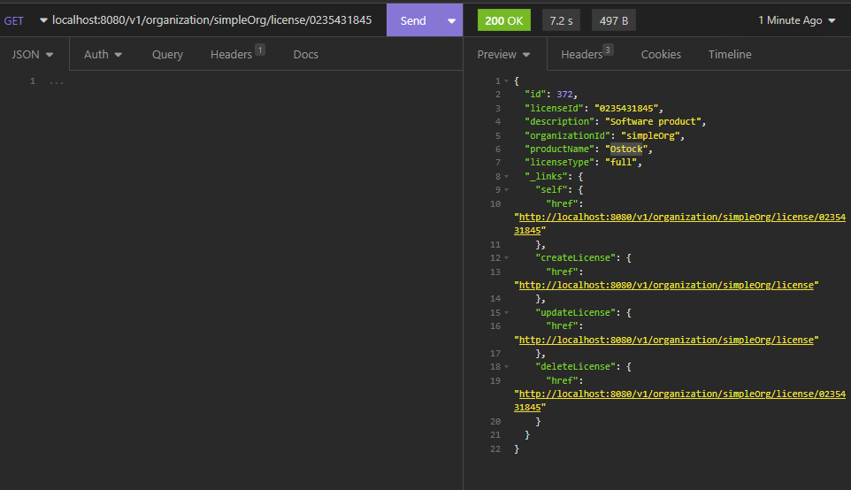
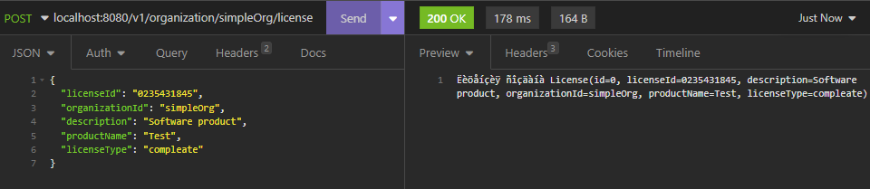
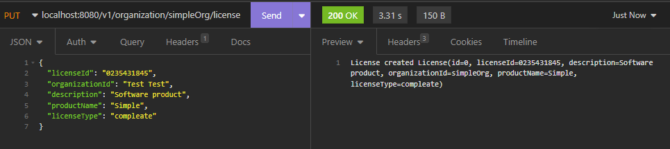

# licensing service

mvn clean package
mvn spring-boot:build-image 

## run image
docker run -it -p8080:8080 docker.io/simple-microservice/licensing-service:latest

## REST example

GET localhost:8080/v1/organization/simpleOrg/license/0235431845

POST localhost:8080/v1/organization/simpleOrg/license

PUT localhost:8080/v1/organization/simpleOrg/license

DELETE localhost:8080/v1/organization/simpleOrg/license/0235431845

